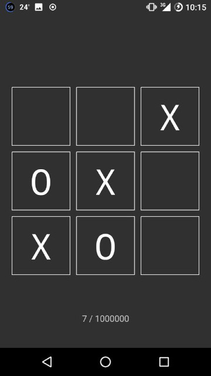
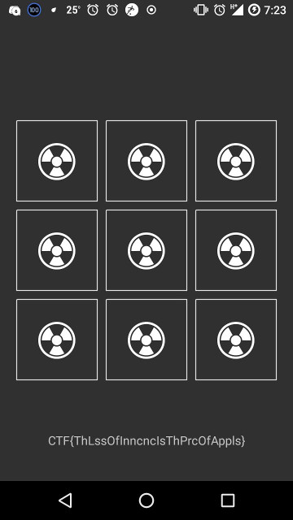

# GoogleCTF Quals 2018 : Shall we play a game (re, 113 points, 111 solves)

## Summary
We are given an android [app](./app.apk) with a tic tac toe game. To obtain the flag, we need to win 1000000 times.

* [Static Analysis](#static-analysis)
* [Solution](#solution)

## Static Analysis
The first thing I always do when getting an apk file (from a trusted source, of course) is to install it, to see what it is about. Since I have an Android device, it is very convenient for me to just use adb.

```bash
$ adb install app.apk
```



### Decompilation
First, I used jadx to decompile the app and view its source.

Looking at AndroidManifest.xml, we see that GameActivity is the activity being launched at the start.

```xml
...
    <application android:theme="@style/AppTheme" android:label="@string/app_name" android:icon="@mipmap/ic_launcher" android:name="android.support.multidex.MultiDexApplication" android:allowBackup="true" android:supportsRtl="true" android:roundIcon="@mipmap/ic_launcher_round">
        <activity android:name="com.google.ctf.shallweplayagame.GameActivity">
...
```

In GameActivity.java, the function I'm interested in at the start is `onClick` and `onCreate`. Nothing much happens in `onCreate`, just some initialization. As for `onClick`, looks like it is performing some game logic.

Here's the code (variables and functions/methods are renamed by myself, if you want to look at the original source, it is [here](./jadx/app/sources/com/google/ctf/shallweplayagame/GameActivity.java)).

```java
public void onClick(View view) {
    if (!this.hasLost && this.animatorsQueue.isEmpty()) {
        CellView cellView = (CellView) view;
        if (cellView.isEmpty())) {
            soundController.playToneA();
            cellValue.setValue(CellView.X);
            if (won(CellView.X)) {
                updateScore();
                return;
            }
            List l = getListOfNonEmptyCells();
            if (l.isEmpty()) {
                updateScore();
                return;
            }
            getRandomElement(l).setValue(a.O);
            if (won(a.O)) {
                lost();
                return;
            } else {
                animate();
                return;
            }
        }
        soundController.playToneB();
    }
}

protected void onCreate(Bundle bundle) {
    super.onCreate(bundle);
    setContentView((int) R.layout.activity_game);
    LinearLayout linearLayout = (LinearLayout) findViewById(R.id.rows);
    for (int i = 0; i < 3; i++) {
        View linearLayout2 = new LinearLayout(getApplicationContext());
        for (int i2 = 0; i2 < 3; i2++) {
            View cell = new CellView(getApplicationContext(), this.m);
            linearLayout2.addView(cell);
            this.l[i2][i] = cell;
            cell.setOnClickListener(this);
        }
        linearLayout.addView(linearLayout2);
    }
}
```

There's nothing interesting in `animate` and `lost`, but `updateScore` seems to have something more than just updating the score. In particular, a list `byteArray1` is modifed during every call to `updateScore`, and I suspect this should contain the flag in some form. And when our score reaches 1,000,000, `showFlag` is invoked.

```java
void updateScore() {
    for (int i = 0; i < 3; i++) {
        for (int i2 = 0; i2 < 3; i2++) {
            this.l[i2][i].setCellValue(a.EMPTY, 25);
        }
    }
    animate();
    this.score++;
    Object _ = N._(Integer.valueOf(2), N.e, Integer.valueOf(2));
    N._(Integer.valueOf(2), N.f, _, this.byteArray1);
    this.byteArray1 = (byte[]) N._(Integer.valueOf(2), N.g, _);
    if (this.score == 1000000) {
        showFlag();
        return;
    }
    ((TextView) findViewById(R.id.score)).setText(String.format("%d / %d", new Object[]{Integer.valueOf(this.score), Integer.valueOf(1000000)}));
}
```

Here, the app prints the flag, using values derived from `byteArray1` and `byteArray2`.

```java
void showFlag() {
    Object _ = N._(Integer.valueOf(0), N.a, Integer.valueOf(0));
    Object _2 = N._(Integer.valueOf(1), N.b, this.byteArray1, Integer.valueOf(1));
    N._(Integer.valueOf(0), N.c, _, Integer.valueOf(2), _2);
    ((TextView) findViewById(R.id.score)).setText(new String((byte[]) N._(Integer.valueOf(0), N.d, _, this.byteArray2)));
    o();
}
```

Lots of variables from the `N` class are being referenced. Taking a peek at it tells us they are different constants. But something catches our eye, the native function `_`.

```java
package com.google.ctf.shallweplayagame;

class N {
    static final int[] a = new int[]{0, 1, 0};
    static final int[] b = new int[]{1, 0, 2};
    static final int[] c = new int[]{2, 0, 1};
    static final int[] d = new int[]{3, 0, 0};
    static final int[] e = new int[]{4, 1, 0};
    static final int[] f = new int[]{5, 0, 1};
    static final int[] g = new int[]{6, 0, 0};
    static final int[] h = new int[]{7, 0, 2};
    static final int[] i = new int[]{8, 0, 1};

    static {
        System.loadLibrary("rary");
    }

    static native Object _(Object... objArr);
}
```

### Native library
To obtain the native library shared object file, I used apktool to disassemble the app. 

*apktool gives smali files, but also contains shared object files, whereas jadx gives java files but there is no shared object file*


```bash
$ java -jar ~/Downloads/apktool_2.3.3.jar d auto_solve.apk
```

Opening up the shared object file in IDA, my immediate thought is to not reverse it. Because `_` was an overloaded function, it seems like the native function does some type checking on the arguments before performing more complex operations on it, which involves a lot of other functions.

## Solution
Clearly, what we need to do now is to run `updateScore()` 1,000,000 times. There are a few ways to this. 

1. Patching the smali file and build it back to an apk file, then install it.
2. Create a new Android project in Android Studio, and manually add all the relevant files, including native libraries, so this will be somewhat troublesome.
3. Use frida to hook `onCreate` and run `updateScore()` directly from there.

**Why can't we just edit the .java file and build it directly?**

Because jadx **decompiles** the apk file, which means code is reconstructed using some heuristics, and does not preserve the project structure used by Android projects. So, we need to create a new Android project ourselves and add in all the stuff needed manually.

On the other hand, apktool **disassembles** the apk file, which means it does not do any code generation by itself, preserving the project structure so it can easily build a patched apk file from that.

### Using Frida
I decided to use Frida as I didn't really feel like messing with the smali code at the time (wasn't very hard actually, someone else in the team did it).

I figured the most convenient way to do it is to hook `onCreate`, let it initialize the stuff it needs, and then call `n()` 1000000 times from there. (`n` is the original function name of `updateScore`, `m` is `showFlag`)

*frida uses javascript to do instrumentation*

```js
Java.perform(function() {
    var GameActivity = Java.use('com.google.ctf.shallweplayagame.GameActivity');

    GameActivity.onCreate.overload('android.os.Bundle').implementation = function (v) {
    	this.onCreate(v)
        for (var i = o; i < 1000000; i++) {
        	send(i);
        	this.n();
        }
    };
})
```

Then, set up a Frida python script to run it.

```python
def on_message(message, data):
	global i, q, changed
	if message['type'] == 'send':
	    print("[*] {0}".format(message['payload']))

print('[*] Spawning app')
device = frida.get_usb_device()
pid = device.spawn('com.google.ctf.shallweplayagame')
session = device.attach(pid)
jscode = open('script.js', 'r').read()
script = session.create_script(jscode)
script.on('message', on_message)
print('[*] Running script')
script.load()
device.resume(pid)
```

All looks good... until when it reaches around 10000 the app crashes. I suppose maybe using such a hooking approach may mess up garbage collection in the app, causing it to run out of memory.

### Spawn app repeatedly
However, this is rather simply to deal with. I modified the js script to only run `n()` up to 10000 times, then dump the values of `score` and `byteArray1`, and store them in a global variable. Then, re-run the app and load those values into `score` and `byteArray1` to continue where we ended off.

```python
i = 0
q = []

def on_message(message, data):
	global i, q, changed
	if message['type'] == 'send':
	    print("[*] {0}".format(message['payload']))
	    i = message['payload'][0]
	    q = message['payload'][1]
	    changed = True
```

Using a while loop, we can keep spawning the app until we get the flag.

```python
while True:
	if i > 1000000:
		exit(0)

	while not changed:
		pass

	changed = False

	jscode = """
Java.perform(function() {
    var GameActivity = Java.use('com.google.ctf.shallweplayagame.GameActivity');
    o = %d

    GameActivity.onCreate.overload('android.os.Bundle').implementation = function (v) {
    	this.onCreate(v)
    	%s
    	if (o < 1000000) {
	        for (var i = o; i < o + 20000; i++) {
	        	this.n();
	        }
			send([i, this.q.value]);
		}
		else {
			this.m();
		}
    };

    GameActivity.k.implementation = function () {
    };
})
""" % (i, "this.q.value = Java.array('byte', %s)" % q if i > 0 else '')

	print('Spawning app')
	device = frida.get_usb_device()
	pid = device.spawn('com.google.ctf.shallweplayagame')
	session = device.attach(pid)
	script = session.create_script(jscode)
	script.on('message', on_message)
	print('[*] Running script')
	script.load()
	device.resume(pid)
```

Full script [here](./solve.py).

### Flag
This approach was really slow, it took around half an hour to finally get the flag. In contrast, if I'd just modified the smali code, it would have been complete in less than a second.

Nevertheless, I still preferred this solution as it is very easy to code. Then, I can just leave the script to run while doing some other stuff, and come back half an hour to get the flag. Unless I'm familiar with smali, it would have taken some brain effort to modify the code to get the flag.

